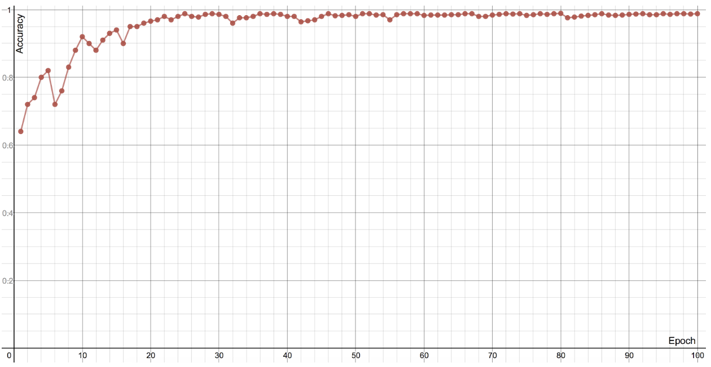

# GlaucomaAI

## 🚀 Quick Start

After cloning the repo, it's as simple as downloading the data and training the model!

```
### Download all data
python3 ./glaucomaAI/download-data.py
```

Use the CSV file provided in this repo for the labels
```
GlaucomaCSV.csv
```

One last step: add the filepaths to the data and labels to ```main.py```
```
### Change these!
DATA_PATH = 'INSERT/PATH/HERE'
CSV_PATH = 'INSERT/PATH/HERE'
```

Now, just run ```main.py``` and watch the model train!



## 👀 Overview
Recent advances in computer vision have enabled accurate diagnosis of glaucoma, the leading cause of worldwide irreversible blindness, but few studies have diagnosed it at multiple stages of progression. We present a convolutional neural network (CNN) that distinguishes between four different clinical diagnosis categories—normal, low-risk suspect, high-risk suspect and glaucoma—with high accuracy. We also make publicly available a dataset of 711 images from the Rand Eye Institute.

## 📦 Data
2811 color fundus images (1074 normal, 562 low-risk suspect, 149 high-risk suspect, 1026 glaucomatous) were collected from a variety of public and private sources: Drishti-GS, RIM-ONE, Harvard Dataverse, and the Rand Eye Institute.


Figure 1: Examples of images from all four categories. From right to left: normal, low-risk suspect, high-risk suspect, and glaucomatous. The glaucoma-suspect images were not available on the public databases and came from the Rand Eye Institute.

## 👍 Methods
The neural network architecture chosen for the task was ResNeXt101_32x8d. The most important part of its architecture is shown below. The identity shortcut connection, inspired by ResNet, allows layers to be stacked without vanishing gradients. ResNeXt also introduces a new hyperparameter called cardinality, the number of more complex transformations.


Figure 2: Left: a building block of ResNet. Right: a building block of ResNeXt with cardinality 32.

The network was trained for 100 epochs with a learning rate scheduler.

## 🔥 Results
The neural network achieved a validation accuracy of 98.93% across the four classes after training.


Figure 3: Confusion matrix for the neural network trained for 100 epochs. This matrix compares the neural network’s predictions for the validation set (a random 20% of the images) with the correct labels for each image in the set.


